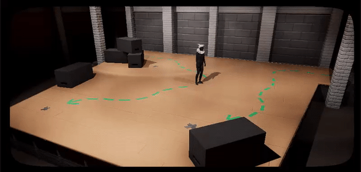
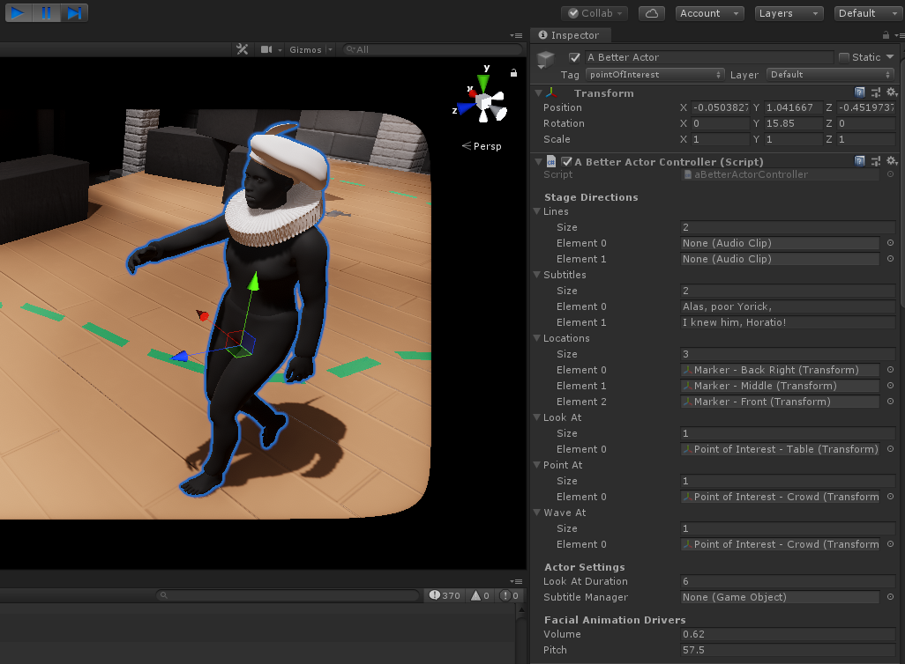
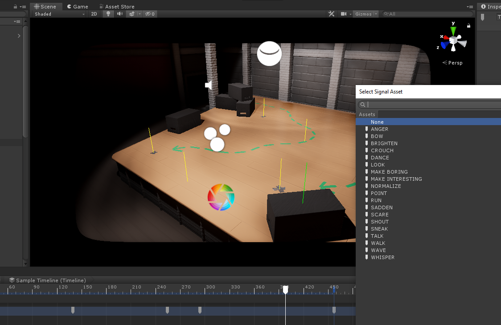

# A Better Actor
## An Easily Directable AI Actor for Unreal & Unity Sequences

While real-time engines offer a modern UX and convenient iteration times, directing actors (as in *acting* actors, not UE4 actors) in a cinematic context is still incredibly tedious, and modern real-time footage or games that offer "unparalleled cinematic experiences" often keep out-of-frame the clunky, barebones production experience that is matching animation clip offsets, tweaking sequencer timings and other fun bits of the virtual production process. If only there was a more streamlined, 1:1 way to do things?

With this engine agnostic package, you can now simply drop your actor (again, *acting* actor, not UE4 actor) into your game engine scene, pipe in some audio & animations from your production database and in a fashion similar to how you would input commands in a game like [NetHack](https://nethackwiki.com/wiki/Commands) (or more relevantly, like you would shout on-set directions to an actor), distill the actor directing process to its real-world essence: *walk here, shout that, bow*.

___

### General Use

Upon plugin install, three new prefabs/blueprints are available to you:
- *A Better Actor* Character
- *Actor Position Marker* Location Marker to direct where you actors will walk to.
- *Actor Point of Interest* Point of interest your actor can look at or point at - By default actors are points of interest also.

After dropping the *A Better Actor* prefab/blueprint into the scene, you will need to fill in the following variables for it to work properly:

- (Unreal Only) *Skeletal Mesh*: The skeletal mesh for your actor - assign this as you would for any other blueprint deriving from the character class.

#### Stage Directions

- *Lines*: Audio clips of your lines that the actor will speak on cue.
- *Subtitles*: Subtitles for the above lines, sent out to the optional *Subtitle Manager* (see below).

- *Locations*: Places (in order) where your actor will walk to throughout the sequence. While this can be any actor/gameobject, the *Actor Position Marker* prefab/blueprint is included for your convenience.
- *Look At*: Things the actor will look at (in order) throughout the sequence. You can leave this empty, and the actor will look at the nearest actor or point of interest nearby.
- *Point At*: Things the actor will point at (in order) throughout the sequence. You can leave this empty, and the actor will point at the nearest actor or point of interest nearby.
- *Wave At*: Things the actor will wave at (in order) throughout the sequence. You can leave this empty, and the actor will wave at the nearest actor or point of interest nearby.

#### Actor Settings

- *Look At Duration*: How long will the actor look at a given item after being driven by the POINT, WAVE or LOOK events.
- *Subtitle Manager*: If your actor's lines have subtitles, the text will be piped into this manager via SendMessage (Unity) or Event Dispatcher (Unreal).

#### Facial Animation Drivers

- *Volume*: Volume of the current sentence being spoken; You can instrument this procedurally animated value to drive facial blendshapes.
- *Pitch*: Pitch of the current sentence being spoken; You can instrument this procedurally animated value to drive facial blendshapes.

If you're using (and realistically you're most probably doing that) a different Skeleton, you can simply duplicate and retarget the included *A Better Actor* [Unity Animator](https://docs.unity3d.com/Manual/Retargeting.html) or [Unreal Animation Blueprint](https://docs.unrealengine.com/en-us/Engine/Animation/RetargetingDifferentSkeletons) and associated animations to your new rig - Note that if you're missing some animations you can always use the royalty-free ones in the package! Pester me if 

Your character set up, it's now only a question of adding them to your Timeline/Sequence, matching them to a Signal (Unity) or Event (Unreal) track and calling the events/signals below. While the plugin is easily extensible, these are the built-in ones included for your convenience:

#### Character Locomotion
- SNEAK: The character will sneak to the next location listed in the *Locations* array.
- WALK: The character will walk to the next location listed in the *Locations* array.
- RUN:  The character will run to the next location listed in the *Locations* array.

#### Dialogue
- TALK: The character will say the next line in the *Lines* array. This will also adjust the *volume* and *pitch* values at runtime so that you can instrument your own facial animation system.

#### Body Language
- POINT: The character will point to the next item in the *Point At* array, or the nearest point of interest if the array is empty.
- WAVE: The character will wave to the next item in the *Wave At* array, or the nearest point of interest if the array is empty.
- LOOK: The character will look at the next item in the *Look At* array, or the nearest point of interest if the array is empty.
- BOW: The character will bow at their current location.

#### Gait Modifiers
- SADDEN: The character will slouch a little and will act a little less lively.
- BRIGHTEN: The character will have a little more pep in their step.
- SCARE: The character will start shaking.
- NORMALIZE: The actor will return to a neutral state.

#### Point of Interest Modifiers
- MAKE BORING: The actor will stop being a point of interest. A good usecase for this is if you want an actor to point out a specific thing in a crowd.
- MAKE INTERESTING: The actor will start being a point of interest.

___

### Installation - Unity 2019.2.0b1

This is a plugin that makes use of Unity's *Package Manager* feature. Just drop the *com.alexismorin.abetteractor* folder (found in the *packages* folder of the Unity Source) into your own project's *packages* folder (found at the same level as your Assets folder) and it should work out-of-the-box. If you're using a pre-packman version of Unity (phew!), navigate inside the *com.alexismorin.abetteractor* folder and then just drag the *Editor* folder you find there anywhere in your project hierarchy.

Make sure you then also register *pointOfInterest* as a new tag in your tag manager.

### Installation - Unreal 4.22

#### The unreal version is *not* yet ready and visible here in the docs only because its easier to format down the road.

___

### Acknowledgements & Thanks

- [e→d films](https://edfilms.net/)' Daniel Gies for having a chat with me and pluging this plugin (haha) idea inside my head.
- [This always excellent piece of Unity documentation.](https://docs.unity3d.com/Manual/nav-CouplingAnimationAndNavigation.html)

### TODO

- Unreal MVP

